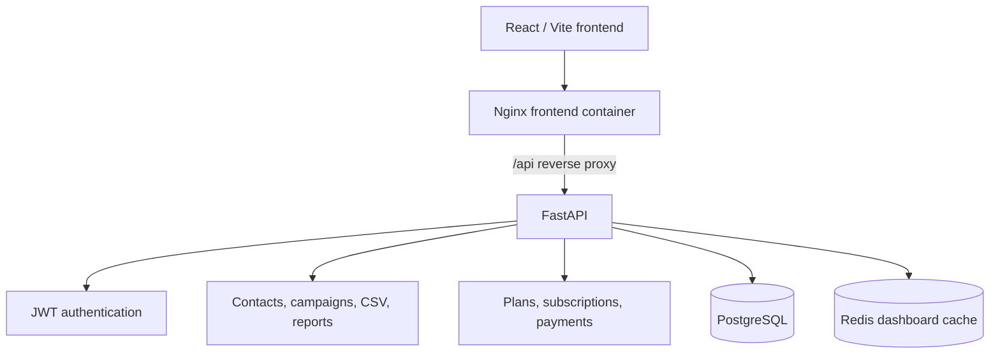

# Current system architecture

The current local deployment is Docker Compose. Nginx/frontend (`8080`) and
FastAPI (`8000`) are published; PostgreSQL and Redis remain internal. The
dashboard calls `/api`, which Nginx forwards to FastAPI. FastAPI scopes all CRM
queries and cache keys to the JWT subject.

WhatsApp delivery, payment processing, AI/OCR, workers, object storage,
Kubernetes, and AWS are not running components.
