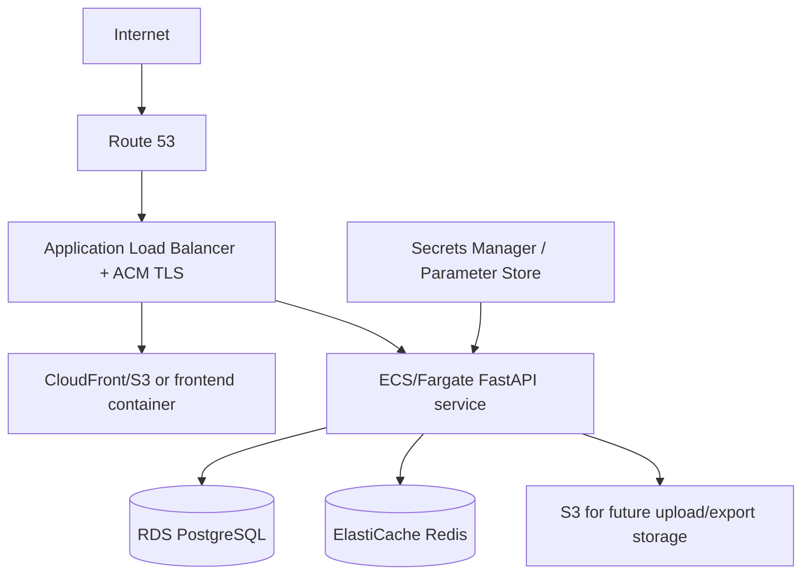

# Proposed AWS Production Architecture

> This is a proposed architecture. HubFlow is not deployed to AWS by this repository.

Map the current frontend, FastAPI, PostgreSQL, Redis, and `.env` configuration
to frontend hosting, ECS, RDS, ElastiCache, and Secrets Manager respectively.
RDS and ElastiCache belong in private subnets, while the ALB is the public TLS
entry point.
