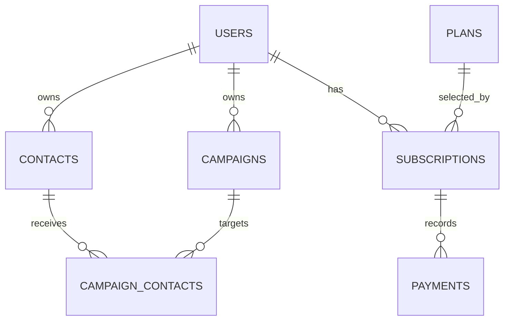

# HubFlow ER diagram and indexing strategy

`users.email` and `plans.name` are unique. Workspace list queries use
`contacts.user_id` and `campaigns.user_id`; `(contacts.user_id, email)` is a
partial unique index for non-empty email addresses. `campaign_contacts` has a
composite primary key and a contact lookup index. Subscription and payment
foreign keys are indexed for billing queries.
